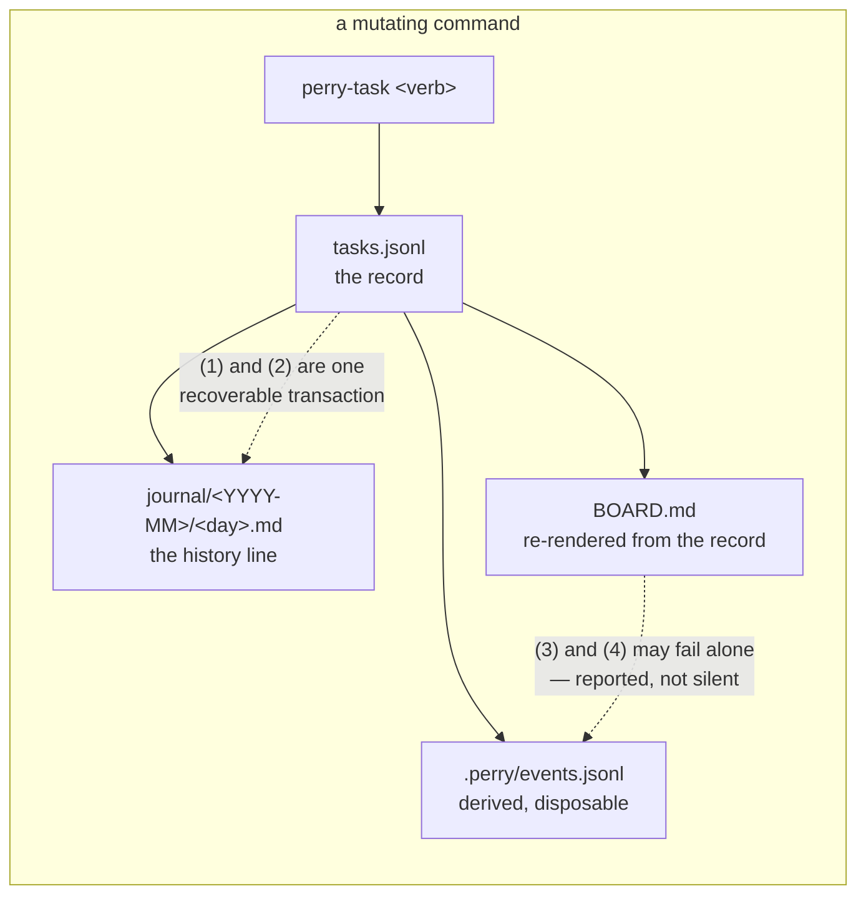
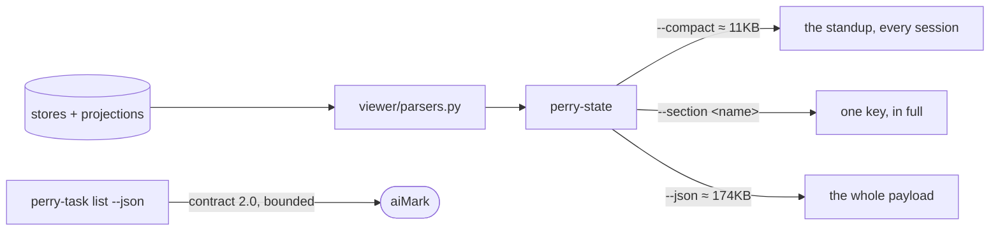

# Architecture — Perry

> Written by: agent · Confirmed by: user (§1, §3 Forbidden, §5 versions, §6, §7)
> Version: v1
> Last reviewed: 2026-09-14
> Hard cap: ≤ 500 lines. It has two readers — the user in one sitting, and every
> agent that is dispatched against it — and the second one pays for it per turn.
> Overflow → split per-§ to `architecture/sections/§<N>-<topic>.md`.

**This file existing is what makes it binding.** There is no draft state: a
document that describes the system is the description, and a change that
contradicts a section stops and asks the user (DESIGN-017 decisions 2 and 4).

<!--
Perry ships this discipline (`packs/software-ops/architecture.md`) and had never
applied it to itself: `perry-state --section architecture` reported
`exists: false` until 2026-09-09.

WHERE THIS FILE LIVES, and it is a correction. It was first written to
`perry/ARCHITECTURE.md`, because `schema/state-schema.json § files[id=architecture]`
anchors it at the STATE root. The user moved it here on 2026-09-09: `perry/` is
Perry's runtime state — board, journal, evidence, stores — and an architecture
document describes CODE. It belongs where someone reading the code will find it,
which is the repository root, beside the directories it maps.

The cost of being right is that the tooling cannot see it yet:
`perry-state --section architecture` reports `exists: false` while this file
sits here. §7's first open question carries that, and it is a defect in the
schema rather than in this file's location.

An open question is referred to by its SECTION, never by its id. `OQ-` is not
one of `lib.PERRY_CITATION_FAMILIES` — a closed set, on purpose — so
`perry-diagnose` reads a prose reference to `OQ-1` as an id that resolves
nowhere and reports it as dangling. Found by Perry's own check, on this file,
the day it was written.

Per-module documents live beside the code they describe — `bin/ARCHITECTURE.md`
is the first, and §2 links each one. They are not the §-overflow files the header
mentions: those split THIS document by section; a module document describes one
directory's internals.
-->

## §1. Mission & scope

Perry is a project office for solo and small projects, run by agents and read by
one human. It keeps goals, work and decisions as files in the project's own
repository, and it computes every number it reports rather than eyeballing it.

It runs as a **skill** on three hosts — Claude Code, OpenCode and Codex CLI —
with no install step and no service. The `bin/` tools are stdlib-only Python 3
and POSIX-ish bash, invoked by the skill's own procedures.

It deliberately does **not**: run unattended (every write is a command an agent
was asked to make), judge what a document means in code (that is an agent's job,
`DESIGN-014`), or hold state outside the project it is pointed at (`ADR-002` —
there is no cross-project registry).

## §2. Components

### `bin/` — the deterministic tools
- **Purpose**: read and write project state. Twenty executables plus three shared
  libraries.
- **Owns**: every write to a canonical store, every computed number the standup
  prints, and the argument contract those calls are made through.
- **Doesn't own**: what to do next. The `SKILL.md` files decide; these tools
  execute and refuse.
- **Module document**: [`bin/ARCHITECTURE.md`](bin/ARCHITECTURE.md)

### `viewer/parsers.py` — the one reader
- **Purpose**: parse every state file. 5,228 lines, one implementation.
- **Owns**: `BOARD.md`, `OKR.md`, phase, linkage, config and architecture
  parsing; the project-root and state-root resolution both `bin/` and the skill
  read through.
- **Doesn't own**: writing. A second parser is the defect this repository has
  shipped twice; `NN-1` below is that rule.

### `schema/` — the declared shape
- **Purpose**: `state-schema.json` (107KB) declares every file, heading, table,
  enum, store and claim. Seven contract pages publish the payloads outside
  consumers read.
- **Owns**: what a file must look like, and what a payload promises.
- **Doesn't own**: how a tool reaches that shape.

### `SKILL.md` + `goals/` `work/` `decide/` — the lanes
- **Purpose**: the router (222 lines, tier 0, read on every invocation) and
  three lane files loaded on demand.
- **Owns**: procedure — what an agent does, in what order, and when it stops to
  ask the user.
- **Doesn't own**: any number. Every figure a lane prints comes from a `bin/`
  call.

### `modes/`, `packs/`, `reference/`, `templates/`
- **Purpose**: the vocabulary a project can declare (four work modes), the
  domain pack (`software-ops`, which is where this discipline is defined),
  tier-1 reference pages loaded on demand, and the scaffolds a new project gets.
- **Owns**: per-project variation. A track's mode, a pack's glossary.

### `tests/` — 136 modules
- **Purpose**: the contract, executable. Includes `tests/tree_guard.py`, which
  fails the suite if a run changed the checkout it ran in.
- **Owns**: whether a claim in this repository is true.

### `perry/` and `.perry/` — this project's own state
- **Purpose**: Perry's state root and anchor. Perry runs its own office in its
  own repository.

## §3. Boundaries & dependencies

Allowed directions: lanes → tools → libraries → state. Tools import `parsers`;
`parsers` imports nothing from `bin/`.

Forbidden, and each one has cost this project something:
- **A second reader of any state file.** `bin/` never re-implements a parse.
- **A lane computing a number.** If a figure is not in a payload, the tool grows
  the field; the procedure does not count rows.
- **A tool reaching another project.** Roots come from `--root`, then
  `$PERRY_PROJECT`, then the walk up — `ADR-002`, and `bin/lib § resolve_project_root`
  is the one implementation.
- **An agent writing `ARCHITECTURE.md`.** This file is the user's.

## §4. Data flow

**The store is truth; the markdown is a projection of it** (`ADR-007`). Every
mutating command writes the record first and renders the file from it.

Eight stores exist, one verdict line each in `perry-lint`'s census:
`tasks.jsonl`, `risks.jsonl`, `intake.jsonl`, `asks.jsonl`, `cadence.jsonl`,
`okr.jsonl`, `linkage.jsonl`, `.perry/config.jsonl`. `cadence.jsonl` is the
newest (TASK-237 deliverable 3b).

The read path is the mirror image and has one entry point:

## §5. Contracts

### Contract: `bin/` → an agent (the argument surface)
- **Input**: `<tool> <subcommand> [flags]`. Each tool declares its surface in
  `SURFACE`; the parser is driven by that declaration.
- **Output**: exit 0 read or written · 1 refused, reason printed · 2 bad
  invocation · 3 the bytes match and the store did not produce them.
- **Invariant on the tool**: a flag reaches only the subcommands that declare
  it. Accepted-and-dropped is a defect (`DESIGN-016` goal 12).
- **Invariant on the caller**: a refusal is an outcome, not a failure. Do not
  fall back to editing the file by hand.

### Contract: `perry-task list --json` → outside consumers
- `schema/task-list-contract.md`, version **2.1** (confirmed by the user
  2026-09-14; 2.1 announces asks and risks read from their stores). `tasks[]` is bounded at 200
  rows by default; `bound.open_total` carries the project's figure.
- **Error mode**: a refusal is JSON on stdout, not prose on stderr.

### Contract: `perry-state --json` / `--compact` → the standup
- `--compact` is a strict projection of `--json`, declared once in
  `perry-state § COMPACT` and asserted against the full payload by test.

### Contract: the schema → both sides
- `perry-lint --templates` fails when a shipped template drifts from
  `state-schema.json`. That check is what keeps the standup from breaking
  silently.

## §6. Non-negotiables

### NN-1 — One reader per state file
- **Severity**: hard
- **Rule**: exactly one implementation parses any given state file, and it lives
  in `viewer/parsers.py`. A `bin/` tool that needs a fact imports it.
- **Rationale**: two parsers of `BOARD.md` disagreed in production twice, and
  the disagreement was invisible until a round-trip test one project later.
- **Check**: `grep -rn "def parse_" bin/ | grep -v perry_store | grep -v _md_store`

### NN-2 — The store is truth; the projection is rendered
- **Severity**: hard
- **Rule**: a mutating command writes the record, then renders the file from it.
  A file edited by hand is drift, and drift is REPORTED — never silently
  absorbed and never silently overwritten.
- **Rationale**: `ADR-007`. Absorbing a hand edit destroys the canonical value;
  overwriting it destroys the human's intent. Both must be visible.

### NN-3 — A write that cannot do what it claims refuses
- **Severity**: hard
- **Rule**: no command reports a write it did not perform. A render that cannot
  place every stored record exits non-zero and names what it could not place.
- **Rationale**: `DESIGN-016 § 1.5`. The documented recovery command reported
  `rendered … from 399 stored record(s)`, exit 0, having restored none of 151
  deleted rows.

### NN-4 — Deterministic tools decide nothing about meaning
- **Severity**: hard
- **Rule**: `bin/` makes only mechanical judgements. Whether a summary reads
  like prose, whether a spec's scope is adequate, whether an ADR applies — all
  belong to an agent or the user.
- **Rationale**: `DESIGN-014`. Five rounds of regex lost to a full stop.
- **Known exceptions**: `perry-codex-preflight` shells out to `codex exec` to
  check the CLI is alive. It judges nothing; it pings.

### NN-5 — The suite never writes into the tree it runs in
- **Severity**: hard
- **Rule**: every test writes to a temporary root. `tests/tree_guard.py` runs on
  every exit path and fails the suite otherwise.
- **Rationale**: an un-rooted `perry-task` call once discharged real board rows
  on every run for months, invisibly, because the sweep is idempotent.

### NN-6 — An agent may describe this file, and may not decide it
- **Severity**: hard
- **Rule**: an agent writes and rewrites the descriptive sections (§2, §4, §5's
  shapes, §8) freely. It may ADD to §6 and §7, marked `proposed`, and may
  delete from neither. Changing §1, a `Forbidden` line in §3, a contract
  version in §5, or a confirmed rule in §6 is a question for the user, asked
  before the change lands.
- **Rationale**: the agent doing the typing is what makes this document
  affordable, and the agent being unable to overrule it is what keeps it from
  becoming a mirror. A description follows the code and can refuse nothing;
  this file has to be able to refuse. DESIGN-017 carries the argument.

## §7. Open questions

- **OQ-1 — The schema anchors this file in the wrong place.** ANSWERED for
  where it lives, open for the fix. `schema/state-schema.json § files[id=architecture]`
  and `§ claims` both anchor `ARCHITECTURE.md` at the STATE root;
  `packs/software-ops/architecture.md` says "at the project root". The user
  settled the question on 2026-09-09: an architecture document describes code,
  so it lives at the code root, and `perry/` holds runtime state only. That
  makes the schema's `anchor: state` the defect — and while it stands,
  `perry-state --section architecture` reports `exists: false` on a project that
  has one. Note `.perry/config.jsonl` already separates `pmo_repo_path` from
  `code_repo_path`, so the resolution rule has somewhere to read from. No row is
  open for this yet.
- **OQ-2 — What is the module document's contract?** This file links
  `bin/ARCHITECTURE.md`, and nothing yet declares its shape, its cap, its owner,
  or what happens when it drifts from the code beside it.
- **OQ-3 — Should `perry-lint` check mermaid?** `perry-state` already counts
  fenced mermaid blocks (`mermaid_count`) and nothing consumes the number.

## §8. Change log

- 2026-09-14 · v1 · Descriptive refresh, measured on main:
  - §2 and the §3 diagram: 20 executables, `parsers.py` 5,228 lines, schema
    107KB, 136 test modules (the last full run).
  - §4: eight stores, with `cadence.jsonl` added, and `--json` ≈ 174KB.
  - §5: `perry-task list` 2.0 → **2.1**, the live version since TASK-237 3a.
    The user confirmed the change the same day, as NN-6 requires for a §5
    contract version.
  - `BOARD.md` still appears in §2, §4 and §6 because the file still exists.
    Its deletion (TASK-237 3c) rewrites those lines.
- 2026-09-09 · v1 · Initial architecture document, written while Perry's own
  `--section architecture` still reported `exists: false`. Driver: the user's
  request for a bidirectional structure channel, and `DESIGN-016`'s finding that
  the `bin/` surface had grown past what one reader could hold.
