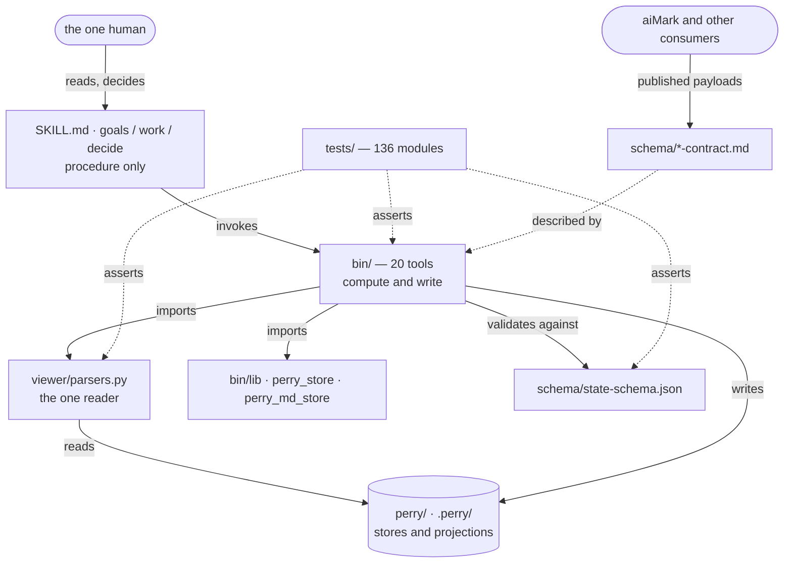
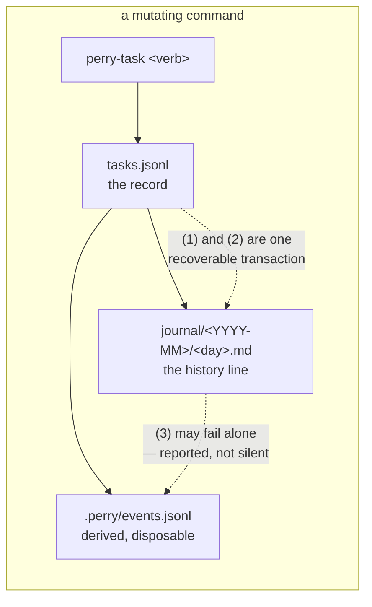
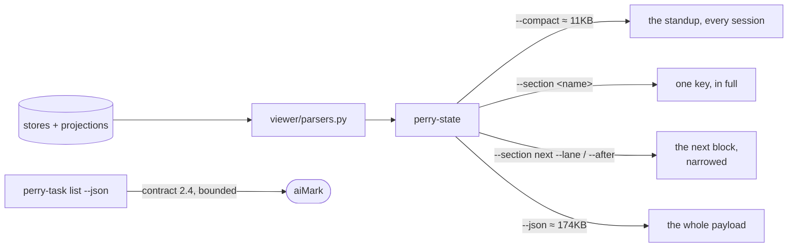

# Architecture — Perry

> Written by: agent · Confirmed by: user (§1, §3 Forbidden, §5 versions, §6, §7)
> Version: v1
> Last reviewed: 2026-09-15
> Hard cap: ≤ 500 lines. It has two readers — the user in one sitting, and every
> agent that is dispatched against it — and the second one pays for it per turn.
> Overflow → split per-§ to `architecture/sections/§<N>-<topic>.md`.

**This file existing is what makes it binding.** There is no draft state: a
document that describes the system is the description, and a change that
contradicts a section stops and asks the user (DESIGN-017 decisions 2 and 4).

<!--
Perry ships this discipline (`packs/software-ops/architecture.md`) and had never
applied it to itself: `perry-state --section architecture` reported
`exists: false` until 2026-09-09.

WHERE THIS FILE LIVES, and it is a correction. It was first written to
`perry/ARCHITECTURE.md`, because `schema/state-schema.json § files[id=architecture]`
anchors it at the STATE root. The user moved it here on 2026-09-09: `perry/` is
Perry's runtime state — board, journal, evidence, stores — and an architecture
document describes CODE. It belongs where someone reading the code will find it,
which is the repository root, beside the directories it maps.

The cost of being right is that the tooling cannot see it yet:
`perry-state --section architecture` reports `exists: false` while this file
sits here. §7's first open question carries that, and it is a defect in the
schema rather than in this file's location.

An open question is referred to by its SECTION, never by its id. `OQ-` is not
one of `lib.PERRY_CITATION_FAMILIES` — a closed set, on purpose — so
`perry-diagnose` reads a prose reference to `OQ-1` as an id that resolves
nowhere and reports it as dangling. Found by Perry's own check, on this file,
the day it was written.

Per-module documents live beside the code they describe — `bin/ARCHITECTURE.md`
is the first, and §2 links each one. They are not the §-overflow files the header
mentions: those split THIS document by section; a module document describes one
directory's internals.
-->

## §1. Mission & scope

Perry is a project office for solo and small projects, run by agents and read by
one human. It keeps goals, work and decisions as files in the project's own
repository, and it computes every number it reports rather than eyeballing it.

It runs as a **skill** on three hosts — Claude Code, OpenCode and Codex CLI —
with no install step and no service. The `bin/` tools are stdlib-only Python 3
and POSIX-ish bash, invoked by the skill's own procedures.

It deliberately does **not**: run unattended (every write is a command an agent
was asked to make), judge what a document means in code (that is an agent's job,
`DESIGN-014`), or hold state outside the project it is pointed at (`ADR-002` —
there is no cross-project registry).

## §2. Components

### `bin/` — the deterministic tools
- **Purpose**: read and write project state. Twenty executables plus three shared
  libraries.
- **Owns**: every write to a canonical store, every computed number the standup
  prints, the argument contract those calls are made through, and the
  **next-step recommendation**: `perry-state --section next` evaluates the
  declared rule table `reference/next-rules.json` over the payload it already
  computes, so the same state gives the same recommendation. The move is the
  user's decision, `perry/design/DESIGN-020-guided-planning.md § 9`, the
  2026-09-15 entry, confirmed by the user in session.
- **Doesn't own**: the rules, which are declared in `reference/`, or the
  procedure around a recommendation — when to show it and what to ask the user
  are the `SKILL.md` files'. These tools execute, compute and refuse.
- **Module document**: [`bin/ARCHITECTURE.md`](bin/ARCHITECTURE.md)

### `release/` — Perry product versions and releases
- **Purpose**: maintain Perry's own product versions and verified release updates.
- **Owns**: typed release records, deterministic VERSION/CHANGELOG projections,
  integration checks and explicit publication of an exact tested commit.
- **Doesn't own**: the versions or state of projects managed by Perry, the
  meaning of authored change notes, or the user's decision to raise a major version.
- **Procedure**: [`release/README.md`](release/README.md).

### `viewer/parsers.py` — the one reader
- **Purpose**: parse every state file. 5,228 lines, one implementation.
- **Owns**: `OKR.md`, phase, linkage, config and architecture parsing, and the
  store readers the read payloads answer from — a `BOARD.md` a project still
  holds is parsed only for the import verbs (TASK-262 round 4b); the
  project-root and state-root resolution, and the `installed` predicate, both
  `bin/` and the skill read through.
- **Doesn't own**: writing. A second parser is the defect this repository has
  shipped twice; `NN-1` below is that rule.

### `schema/` — the declared shape
- **Purpose**: `state-schema.json` (107KB) declares every file, heading, table,
  enum, store and claim. Eight contract pages publish the payloads outside
  consumers read; `next-contract.md` is the eighth.
- **Owns**: what a file must look like, and what a payload promises.
- **Doesn't own**: how a tool reaches that shape.

### `SKILL.md` + `goals/` `work/` `decide/` — the lanes
- **Purpose**: the router (tier 0, read on every invocation; its byte cap is
  `tests/test_router_budget.py`'s) and three lane files loaded on demand.
- **Owns**: procedure — what an agent does, in what order, and when it stops to
  ask the user. A lane **renders** the next step `perry-state --section next`
  returns: **in a standup's TL;DR and in its next-step position** it does not
  add, drop or reorder a recommendation, and it may add one line marked as its
  own note (`perry/design/DESIGN-020-guided-planning.md § 9`, the 2026-09-15
  entry, confirmed by the user in session).
- **Outside that rule**, and still the lane's own to write: a procedural step
  inside a subcommand's instructions ("read this, then run that"); the
  remediation a refusal names ("no current phase — run `plan-phase` first");
  bootstrap and first-run prompts; and a hint in a rendered dashboard row.
  First-time setup is the largest of them: on a directory with no Perry state
  `R-setup` recommends only `/perry`, and the order setup recommends after
  that is the router's own (`reference/first-run.md § The recommended order for
  a new project`, which the router's first-time setup points to). The rule is
  about the one position the next block owns, not about naming a command.
- **Doesn't own**: any number, or which step to recommend. Every figure a lane
  prints comes from a `bin/` call, and so does the recommendation.

### `modes/`, `packs/`, `reference/`, `templates/`
- **Purpose**: the vocabulary a project can declare (four work modes), the
  domain pack (`software-ops`, which is where this discipline is defined),
  tier-1 reference pages loaded on demand, and the scaffolds a new project gets.
  `reference/` also holds `next-rules.json`, the rule table `bin/perry-state`
  evaluates for the next step, and `next.md`, which explains each rule.
- **Owns**: per-project variation. A track's mode, a pack's glossary. The
  next-step rules, declared as data that `bin/` evaluates.

### `tests/` — 136 modules
- **Purpose**: the contract, executable. Includes `tests/tree_guard.py`, which
  fails the suite if a run changed the checkout it ran in.
- **Owns**: whether a claim in this repository is true.

### `perry/` and `.perry/` — this project's own state
- **Purpose**: Perry's state root and anchor. Perry runs its own office in its
  own repository.

## §3. Boundaries & dependencies

Allowed directions: lanes → tools → libraries → state. Tools import `parsers`;
`parsers` imports nothing from `bin/`.

Forbidden, and each one has cost this project something:
- **A second reader of any state file.** `bin/` never re-implements a parse.
- **A lane computing a number.** If a figure is not in a payload, the tool grows
  the field; the procedure does not count rows.
- **A tool reaching another project.** Roots come from `--root`, then
  `$PERRY_PROJECT`, then the walk up — `ADR-002`, and `bin/lib § resolve_project_root`
  is the one implementation.
- **An agent writing `ARCHITECTURE.md`.** This file is the user's.

## §4. Data flow

**The store is truth; the markdown is a projection of it** (`ADR-007`). Every
mutating command writes the record first. The board is not a file:
`perry-tasks board` prints it from the stores. A `BOARD.md` a project still
holds is retired — no write or reader uses it, only the `--from-board` imports
read it, and every tool that sees it says to import and then delete it
(TASK-262 rounds 4a and 4b).

Eight stores exist, one verdict line each in `perry-lint`'s census:
`tasks.jsonl`, `risks.jsonl`, `intake.jsonl`, `asks.jsonl`, `cadence.jsonl`,
`okr.jsonl`, `linkage.jsonl`, `.perry/config.jsonl`. `cadence.jsonl` is the
newest (TASK-237 deliverable 3b).

The read path is the mirror image and has one entry point:

`--section next` is the one section that is not always the payload's key as it
stands. With `--lane` or `--after` it prints the block evaluated again over
only that lane's or that subcommand's rules, plus the overlays (TASK-442).

## §5. Contracts

### Contract: `bin/` → an agent (the argument surface)
- **Input**: `<tool> <subcommand> [flags]`. Each tool declares its surface in
  `SURFACE`; the parser is driven by that declaration.
- **Output**: exit 0 read or written · 1 refused, reason printed · 2 bad
  invocation · 3 the bytes match and the store did not produce them.
- **Invariant on the tool**: a flag reaches only the subcommands that declare
  it. Accepted-and-dropped is a defect (`DESIGN-016` goal 12).
- **Invariant on the caller**: a refusal is an outcome, not a failure. Do not
  fall back to editing the file by hand.

### Contract: `perry-task list --json` → outside consumers
- `schema/task-list-contract.md`, version **2.4** (confirmed by the user
  2026-09-15; 2.2 adds `installed`, 2.3 narrows it to a store with `.perry/`
  beside it, 2.4 reads no `BOARD.md` a project still holds — TASK-262 round
  4b). `tasks[]` is bounded at 200
  rows by default; `bound.open_total` carries the project's figure.
- **Error mode**: a refusal is JSON on stdout, not prose on stderr.

### Contract: `perry-state --json` / `--compact` → the standup
- `--compact` is a strict projection of `--json`, declared once in
  `perry-state § COMPACT` and asserted against the full payload by test.

### Contract: the schema → both sides
- `perry-lint --templates` fails when a shipped template drifts from
  `state-schema.json`. That check is what keeps the standup from breaking
  silently.

## §6. Non-negotiables

### NN-1 — One reader per state file
- **Severity**: hard
- **Rule**: exactly one implementation parses any given state file, and it lives
  in `viewer/parsers.py`. A `bin/` tool that needs a fact imports it.
- **Rationale**: two parsers of `BOARD.md` disagreed in production twice, and
  the disagreement was invisible until a round-trip test one project later.
- **Check**: `grep -rn "def parse_" bin/ | grep -v perry_store | grep -v _md_store`
- **Known exceptions**: `bin/perry-context-budget` reads one key
  (`session_context_ceiling`) of `.perry/config.jsonl` directly, because it
  must work outside a Perry project (USER-971, 2026-09-18).

### NN-2 — The store is truth; the projection is rendered
- **Severity**: hard
- **Rule**: a mutating command writes the record first. Every reading of it — a
  payload and `perry-tasks board` — is derived from the record. No command
  reads, renders or creates a board file; a `BOARD.md` a project still holds is
  retired, is read only by the import verbs that upgrade the project, and every
  tool that sees one says it can be deleted. A projection edited by hand is not
  absorbed: the store is what every reading reports.
- **Rationale**: `ADR-007`. Absorbing a hand edit destroys the canonical value;
  overwriting it destroys the human's intent. Both must be visible.

### NN-3 — A write that cannot do what it claims refuses
- **Severity**: hard
- **Rule**: no command reports a write it did not perform. A render that cannot
  place every stored record exits non-zero and names what it could not place.
- **Rationale**: `DESIGN-016 § 1.5`. The documented recovery command reported
  `rendered … from 399 stored record(s)`, exit 0, having restored none of 151
  deleted rows.

### NN-4 — Deterministic tools decide nothing about meaning
- **Severity**: hard
- **Rule**: `bin/` makes only mechanical judgements. Whether a summary reads
  like prose, whether a spec's scope is adequate, whether an ADR applies — all
  belong to an agent or the user.
- **Rationale**: `DESIGN-014`. Five rounds of regex lost to a full stop.
- **Known exceptions**: `perry-codex-preflight` shells out to `codex exec` to
  check the CLI is alive. It judges nothing; it pings.

### NN-5 — The suite never writes into the tree it runs in
- **Severity**: hard
- **Rule**: every test writes to a temporary root. `tests/tree_guard.py` runs on
  every exit path and fails the suite otherwise.
- **Rationale**: an un-rooted `perry-task` call once discharged real board rows
  on every run for months, invisibly, because the sweep is idempotent.

### NN-6 — An agent may describe this file, and may not decide it
- **Severity**: hard
- **Rule**: an agent writes and rewrites the descriptive sections (§2, §4, §5's
  shapes, §8) freely. It may ADD to §6 and §7, marked `proposed`, and may
  delete from neither. Changing §1, a `Forbidden` line in §3, a contract
  version in §5, or a confirmed rule in §6 is a question for the user, asked
  before the change lands.
- **Rationale**: the agent doing the typing is what makes this document
  affordable, and the agent being unable to overrule it is what keeps it from
  becoming a mirror. A description follows the code and can refuse nothing;
  this file has to be able to refuse. DESIGN-017 carries the argument.

## §7. Open questions

- **OQ-1 — The schema anchors this file in the wrong place.** ANSWERED for
  where it lives, open for the fix. `schema/state-schema.json § files[id=architecture]`
  and `§ claims` both anchor `ARCHITECTURE.md` at the STATE root;
  `packs/software-ops/architecture.md` says "at the project root". The user
  settled the question on 2026-09-09: an architecture document describes code,
  so it lives at the code root, and `perry/` holds runtime state only. That
  makes the schema's `anchor: state` the defect — and while it stands,
  `perry-state --section architecture` reports `exists: false` on a project that
  has one. Note `.perry/config.jsonl` already separates `pmo_repo_path` from
  `code_repo_path`, so the resolution rule has somewhere to read from. No row is
  open for this yet.
- **OQ-2 — What is the module document's contract?** This file links
  `bin/ARCHITECTURE.md`, and nothing yet declares its shape, its cap, its owner,
  or what happens when it drifts from the code beside it. *Partly answered
  2026-09-21 (USER-978):* a component §2 declares no module document for has
  none — an architecture reviewer does not count its absence as missing
  context. Shape, cap, owner and drift stay open.
- **OQ-3 — Should `perry-lint` check mermaid?** `perry-state` already counts
  fenced mermaid blocks (`mermaid_count`) and nothing consumes the number.
- **OQ-4 — May `--compact` be accepted with `--section next`?** *Proposed*
  (TASK-442). `DESIGN-020 § 5.4`'s closing step runs
  `perry-state --section next --after <subcommand> --compact`, and
  `perry-state` refuses `--compact` together with `--section`. `TASK-443`
  builds that step and needs one of the two to give way.
- **OQ-5 — Should the contract registry recognise a family that is not
  `/list`?** *Proposed* (TASK-442). `perry-next/1.0` is one object, not a list.
  `tests/contract_key_parity.py § CONTRACT_ID` matches only a three-part id, so
  the parity baseline keys `schema/next-contract.md` by its path, and two
  registry tests had their `/list` assumption widened to take the page at all.
- **OQ-6 — May `--section <name>` print something other than the payload's
  key?** *Proposed* (TASK-442). §4 describes a section as one key in full.
  `--section next` with `--lane` or `--after` prints a block evaluated over
  fewer rules, which is not what `--json` carries under `next`.
- **OQ-7 — Does the phase heartbeat survive the move to `--section next`?**
  *Proposed* (TASK-442). `goals/SKILL.md` prompted a phase snapshot after
  `phase_heartbeat_days`. That prompt is now the rule `R-phase-heartbeat`, but
  no value in `perry-state`'s payload dates the last snapshot, so the rule
  reports its fact unknown and never fires. Keeping it needs `perry-state` to
  compute that date; dropping it means deleting the rule.
- **OQ-8 — What covers the lane lines that name a command with no rule
  behind them?** *Proposed* (TASK-442). Two kinds are marked and waiting.
  **After a subcommand**: `goals/SKILL.md`'s `score-phase` row and
  `goals/reference/phases.md` step 9, both naming `plan-phase`. They are the
  proactive closing step `TASK-443` builds; when it ships it renders
  `--after score-phase` and the two lines go. **In a standup's next-step
  position**: an ADR whose sunset date has passed and the old-style
  `DECISIONS.md` migration, both in `decide/reference/decisions.md`, and the
  undigested `inputs/` and stale-digest counts in
  `work/reference/digests.md`. `reference/next-rules.json` has a rule for none
  of the four, and **the reason is the bound, not a missing fact**:
  `DESIGN-020 § 5.3`'s table is what `TASK-442` was bounded to and names none
  of them, so each is a later row's work. Two of the four already have their
  fact — `decisions.expired_sunsets` for the sunset, and
  `operations.inputs` with `operations.inputs_oldest` and
  `operations.inputs_oldest_days` for the digests. Stale digests have no count
  in the payload, only per-card staleness under `roles.cards[].knowledge[]`,
  and the migration has no fact at all; those two need a fact as well as a
  rule.

## §8. Change log

- 2026-09-21 · v1 · USER-978, after two architecture reviews came back BLOCKED
  (`perry/evidence/2026-09/2026-09-21-architecture-review-task-471.md`,
  `…-architecture-review-entry-skills.md`):
  - §6 NN-1 gains the Known exception USER-971 decided on 2026-09-18 and that
    was never written: `perry-context-budget`'s direct read of one config key.
  - §7 OQ-2 records that a component with no declared module document has none.
  - §2, descriptive: the router's line count is dropped (it was 222, then 181 —
    a number that drifts is not architecture), and the new-project order is
    cited where TASK-470 moved it, `reference/first-run.md`.

- 2026-09-15 · v1 · TASK-442, descriptive (NN-6), on its branch:
  - §2 `bin/` owns the next-step recommendation: `perry-state --section next`
    evaluates `reference/next-rules.json` over its own payload, and the lanes
    render what it returns. The move is the user's decision in
    `perry/design/DESIGN-020-guided-planning.md § 9`, the 2026-09-15 entry,
    confirmed by the user in session. `bin/ARCHITECTURE.md § 1` says the same.
  - §2 `schema/`: eight contract pages. §2 `reference/`: it holds the rule
    table `bin/` evaluates.
  - §4's read path names the narrowed `--section next`.
  - §2's lanes say first-time setup sits outside the next block.
  - §7 gains five questions marked proposed. The fourth is the phase
    heartbeat. `goals/SKILL.md`'s heartbeat prompt became the rule
    `R-phase-heartbeat`, declared with its fact reported unknown, because
    `perry-state` computes no date for the last snapshot. It sits after
    `R-review-due`, because DESIGN-020's order has no place for it. The fifth
    asks what replaces the two after-subcommand suggestions.
  - §2's rule is narrowed to the position the next block owns — a standup's
    TL;DR and its next-step position — and names what sits outside it:
    procedural steps, a refusal's remediation, bootstrap and first-run
    prompts, and dashboard row hints. The user decided that in session on
    2026-09-15, after three review rounds each found a different lane line
    that names a command legitimately. Five TL;DR examples in the three lanes
    describe state instead of naming a step, and the `goals` bootstrap prompt
    says it is outside the rule; a sixth TL;DR example and four standup
    instructions followed when later reviews read the lane documents whole.
  - §1, §3, §5 and §6 are not edited.
- 2026-09-15 · v1 · **User-confirmed** (NN-6), after TASK-262 rounds 4a and 4b
  retired a `BOARD.md` a project still holds:
  - §6 NN-2 takes the wording proposed in
    `perry/evidence/2026-09/TASK-262-round3-result.md § 5`: no command reads,
    renders or creates a board file; a held file is read only by the import
    verbs, and every tool that sees one says it can be deleted. The "drift is
    REPORTED" clause for the file is dropped. The user chose not to record the
    `perry-tasks render` / `diff` / `verify` verbs, which still act on a held
    file when called, as a known exception; they retire with `R5`.
  - §5 `perry-task list` 2.3 → 2.4.
  - Descriptive: §2's `viewer/parsers.py` no longer reads a held board for
    payloads; §4's prose and write diagram lose the re-rendered `BOARD.md`
    node, and its read-path label moves to 2.4.
- 2026-09-14 · v1 · TASK-237 3c, measured on its branch:
  - `perry/BOARD.md` is deleted. §2's `viewer/parsers.py` no longer owns a
    board this repository holds; §4's write diagram and its sentence name the
    board as re-rendered only where a project still holds one.
  - Not edited, because NN-6 makes them the user's: §6 NN-2's projection
    wording, and §5's `perry-task/list` version (2.1 here; the tool emits 2.3).
    Both are proposed in `perry/evidence/2026-09/TASK-237-d3c-result.md § 5`.
- 2026-09-14 · v1 · **User-confirmed** (NN-6), after TASK-237 3c deleted
  `perry/BOARD.md`:
  - §6 NN-2 no longer says the command renders "the file". The rule is kept:
    the record comes first, every reading derives from it, a projection is
    re-rendered and never created, and a hand edit is reported drift.
  - §5 `perry-task list` 2.1 → 2.3.
  - §4's read-path label 2.0 → 2.3.
- 2026-09-14 · v1 · Descriptive refresh, measured on main:
  - §2 and the §3 diagram: 20 executables, `parsers.py` 5,228 lines, schema
    107KB, 136 test modules (the last full run).
  - §4: eight stores, with `cadence.jsonl` added, and `--json` ≈ 174KB.
  - §5: `perry-task list` 2.0 → **2.1**, the live version since TASK-237 3a.
    The user confirmed the change the same day, as NN-6 requires for a §5
    contract version.
  - `BOARD.md` still appears in §2, §4 and §6 because the file still exists.
    Its deletion (TASK-237 3c) rewrites those lines.
- 2026-09-09 · v1 · Initial architecture document, written while Perry's own
  `--section architecture` still reported `exists: false`. Driver: the user's
  request for a bidirectional structure channel, and `DESIGN-016`'s finding that
  the `bin/` surface had grown past what one reader could hold.
