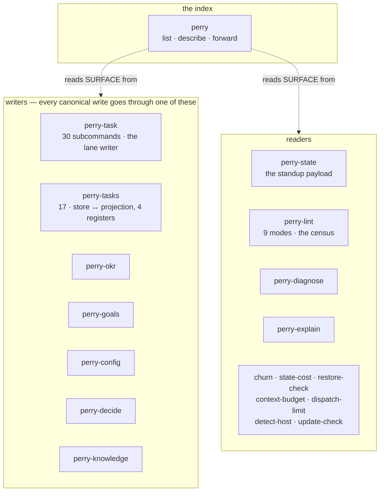
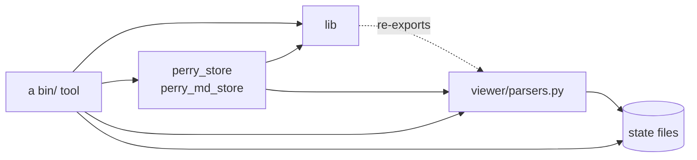
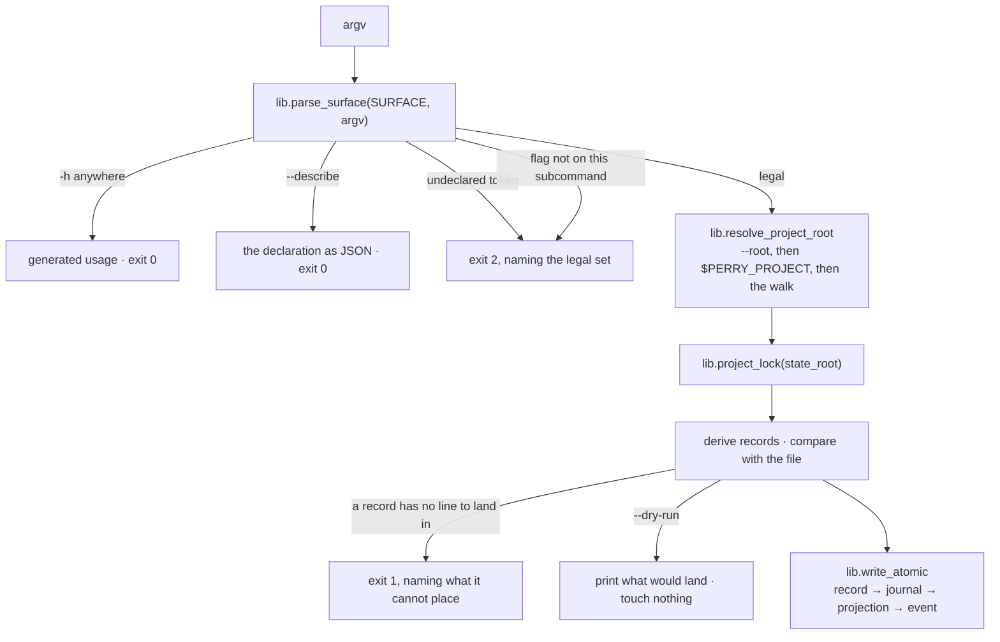

# Architecture — `bin/`

> Written by: agent · Confirmed by: user (§6, §7)
> Version: v1
> Last reviewed: 2026-09-09
> Module document for the `bin/` component. The project's is [`ARCHITECTURE.md`](../ARCHITECTURE.md) § 2.
> Cap: ≤ 600 lines. This describes the directory's structure, not its usage — usage is `bin/README.md`, and `bin/perry list` is the generated index.

## §1. Mission & scope

Nineteen executables and three libraries. Everything Perry reports as a number
is computed here, and every write to a canonical file goes through here.

The rule the directory exists to enforce: **a number Perry reports must be
computed, never eyeballed.** An agent that opens `BOARD.md` and counts blocked
rows is right most of the time, and the times it is wrong are invisible.

It does not decide what to do. It does not call a model, with one named
exception. It does not judge what a document means.

## §2. Components

### The three libraries

| Module | Lines | What it holds |
|---|---|---|
| `lib/__init__.py` | 1,979 | primitives every tool needs: the project-root resolver, the argument parser driven by a `SURFACE` declaration, the project lock, atomic writes, the schema loader, KR progress |
| `perry_store.py` | 1,667 | the record shape and the renderer for `BOARD.md` and its three registers |
| `perry_md_store.py` | 1,381 | the same pair for documents keyed by heading — `OKR.md` today |

### The one tool that reaches outside

`perry-codex-preflight` shells out to `codex exec` to check the CLI answers
before a dispatch depends on it. It is the only dependency in this directory
(`codex`, `git`, `timeout`) and the only thing here that touches a model.

## §3. Boundaries & dependencies

Rules, each with a scar behind it:

- **A tool never parses a state file itself.** `parsers` is the reader; `lib`
  re-exports `resolve_state_root` from it rather than holding a second body.
- **A tool never imports another tool** — except `perry-tasks` and `perry-task`,
  which load each other as modules through one cached loader, because the board
  writer and the store renderer must be the same function.
- **`lib` imports no tool.** It is the bottom.
- **The lock spans the read, the decision and the write.** Taking it only around
  the rename still lets a concurrent writer decide against stale bytes.

## §4. Data flow — what happens to one command

The refusal branches are the point of the diagram. Three of them were added by
`DESIGN-016` after each had been measured as a silent success.

## §5. Contracts

### The declaration — `SURFACE`
Every converted tool carries one: `name`, `kind`, `summary`, `root_resolution`,
`exit_codes`, `flags[]`, and `subcommands[]` with per-subcommand flag lists.
It drives the parser, `--describe --json`, the generated usage block and
`bin/perry list`. Six tools declare one; thirteen do not, and `perry list` says
which.

### The registers — `perry-tasks`
Five verbs (`build verify write render diff`) over four registers, and the
register is a parameter: `--register risks` is `risks-build`. The register list
is read from `schema/state-schema.json § claims` — the `work`-owned stores — so
a fifth store gets the verbs without an edit here.

### Exit codes
`0` read or written · `1` refused, reason printed · `2` bad invocation ·
`3` the bytes match and the store did not produce them.

## §6. Non-negotiables

### NN-B1 — `--help` never runs anything
- **Severity**: hard
- **Rule**: `-h` / `--help` in any argument position prints and exits, before
  dispatch and before any lock.
- **Rationale**: `perry-tasks render --write --help` used to run the render.

### NN-B2 — An undeclared token is refused, never ignored
- **Severity**: hard
- **Rule**: a token starting with `-` that the declaration does not carry exits
  2 and names the legal set. So does a declared flag on a subcommand that does
  not list it.
- **Rationale**: `--wrte` printed a render, wrote nothing and exited 0.
  `--design` and `--kr` were each accepted by a flat flag table and dropped by
  the handler.
- **Check**: `bash tests/run --only test_bin_surface`

### NN-B3 — One resolver, one order
- **Severity**: hard
- **Rule**: `--root`, then `$PERRY_PROJECT`, then the walk up. One
  implementation, `lib.resolve_project_root`. `perry-diagnose` passes
  `walk=False` because it judges the directory it is pointed at.
- **Rationale**: three tools had the order inverted and two of them write; a
  write landed in a project the caller did not name.

### NN-B4 — A tool's own document is short
- **Severity**: soft
- **Rule**: `--help` is usage first, generated from the declaration. The
  argument for a refusal lives in `bin/README.md § The argument, per tool`.
- **Rationale**: `perry-task --help` was 10,690 bytes with `Usage:` at line 51,
  so an agent asking what `done` takes paid ~2.5k tokens for fifty lines of
  history.

## §7. Open questions

- **OQ-B1 — The other thirteen tools.** Six declare a `SURFACE`. Converting the
  rest is mechanical but not free, and `perry list` reports them as undeclared
  in the meantime. No row is open for it.
- **OQ-B2 — Should `perry-task` be split?** 8,294 lines and 30 subcommands
  against `perry-okr`'s 46. The subcommands cover five different objects
  (tasks, risks, intake, asks, cadences); `DESIGN-016 § 1.4` records the option
  of redrawing the tools by object and does not take it.
- **OQ-B3 — What keeps this file true?** Nothing does yet. The project
  document's §7 asks the same thing about the module contract.

## §8. Change log

- 2026-09-09 · v1 · Written with `DESIGN-016` phases A–D landed: the argument
  contract, the declaration, the index and the register parameter are all in
  the diagrams above because they are what changed the directory's shape.
