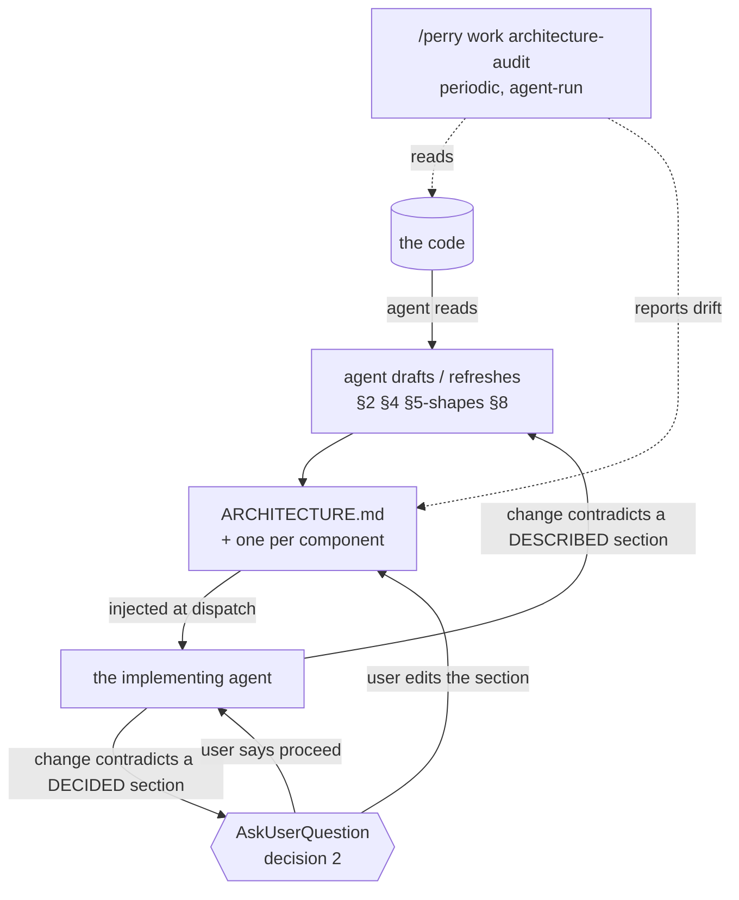

# DESIGN-017: The architecture document is written by the agent and decided by the user

> Status: draft
> Date: 2026-09-09 · Locked: —
> Author: PMO Agent   · Implementation owner: Coding Agent
> Linked OKR: —
> Supersedes: —   · Superseded by: —
> Revisits: `packs/software-ops/architecture.md`, `schema/state-schema.json § files[id=architecture]`, `work/state/ARCHITECTURE_TEMPLATE.md`, `work/SKILL.md § architecture`

## 1. Problem

Perry ships an architecture discipline and has never used it. Measured
2026-09-09 on this repository: `perry-state --section architecture` reported
`exists: false`, while `packs/software-ops/architecture.md` (292 lines), a
110-line template, a parser (`viewer/parsers.py § parse_arch_meta`), a schema
declaration, a dispatch compliance gate and an `architecture-audit` subcommand
had all been shipped for other projects to use.

### 1.1 The premise it was built on is no longer true

The shipped design is built on one sentence — **"The user writes it. Agents read
it. The PMO enforces it."** Everything follows from that: `owner: user` in the
schema, "Agents never write" in the pack, `Status: draft` until the user
finishes authoring, and a dispatch gate that only arms when they do.

The user's position, 2026-09-09: *nobody in the AI era wants to hand-write a
few hundred lines of documentation.* The document is written by the agent. It
serves two readers at once — the user, to understand a system that no longer
fits in one head, and the agent, as the overall design it implements against.

That is not a small edit to the pack. It removes the property the enforcement
loop rested on.

### 1.2 A document written and read by the same agent is a mirror

The user-authored version could say **"the code must not do X"**, and a change
contradicting it was refused. The refusal was credible because the document's
author and the code's author were different.

Agent writes, agent reads, and the default outcome is a mirror: the code is
whatever it is, the document is regenerated to match, and it never disagrees
with anything. It keeps its value for the user — a readable map — and loses all
of it for the agent, because `Touches architecture:` and the review gate then
compare a change against a description of that same change.

**This is the whole design problem.** Everything below is one answer to it:
separate what the document DESCRIBES from what it DECIDES, and let the agent do
all the typing in both.

### 1.3 The location was wrong, and the schema is why

`schema/state-schema.json` anchors `ARCHITECTURE.md` at the STATE root;
`packs/software-ops/architecture.md` says "at the project root". For Perry —
state root `perry/` — those are different files, and the first draft of this
work went to `perry/ARCHITECTURE.md` by following the schema.

`perry/` is runtime state: board, journal, evidence, seven stores. An
architecture document describes CODE and belongs where someone reading the code
finds it. The file now sits at the repository root, and the tooling cannot see
it: `--section architecture` reports `exists: false` on a project that has one.
`.perry/config.jsonl` already separates `pmo_repo_path` from `code_repo_path`,
so a resolver has somewhere to read from.

## 2. Goals

1. An agent can write and keep the whole document current without asking, for
   everything that is a DESCRIPTION of the system.
2. An agent cannot change what the document DECIDES without the user seeing the
   question first.
3. The document is worth injecting into a dispatch: small enough to pay for per
   turn, and specific enough that "does this change contradict it" has an
   answer.
4. Consistency between document and code is an AGENT's job, run periodically —
   not a test suite that grows with the project.
5. One component, one document. The root document's §2 is the component list
   and therefore the index of module documents.
6. A document that exists is in force. There is no draft state.
7. The resolver finds the document where the code is.

## 3. Non-Goals

- **Not a mechanical consistency check.** No `perry-lint --architecture`, no
  test that every §2 component resolves to a path, no assertion that mermaid
  nodes name real files. The user's decision, and the reason is iteration
  burden: a check that has to be updated with every refactor is a tax on the
  refactor, and this project's tests are already 1,019 serial seconds.
  Accepted cost: **between audits, nothing catches drift.**
- **Not a second design document.** `perry/design/DESIGN-*.md` argue a change;
  this describes the system as it stands. A design that lands changes the
  architecture document; it does not become one.
- **Not per-file documentation.** One document per COMPONENT, and components
  are named in §2 by the user's confirmation.
- **Not a replacement for `bin/README.md`.** That is usage. This is structure.

## 4. User Decisions

| # | Decision | Options | Chosen | Date |
|---|---|---|---|---|
| 1 | How much mechanical checking | A lint mode + tests per rule / cheap existing signals only / none | **Cheap existing signals only** — no new checks; consistency is a periodic agent audit | 2026-09-09 |
| 2 | What a change touching a hard `§6` rule does | Refuse the dispatch / ask the user / warn and proceed | **Ask the user** | 2026-09-09 |
| 3 | Module document granularity | Per directory / per component, user-confirmed / per file | **One component, one document; §2's list is user-confirmed** | 2026-09-09 |
| 4 | The `Status: draft \| active` field | Keep, gate on `active` / drop it: existing means in force | **Drop it** | 2026-09-09 |

**What decision 1 costs, stated so nobody re-derives it.** The four checks that
were on the table — every §2 component resolves to a path, every §6 rule
carries a runnable `Check:`, every mermaid node names something real, a module
document older than its directory's last commit is stale — are all cheap to
write and none is free to keep. Each one turns a refactor into a refactor plus a
document edit plus a test edit. The user chose flexibility, and the
consequence is that a stale architecture document is discovered by an agent
reading it, not by a red suite. That makes the audit cadence the only real
guard, which is why § 6 puts it on a schedule rather than leaving it on demand.

**Decision 4 has a consequence in code.** `perry-state` warns
`ARCHITECTURE.md is still Status: draft` and the pack arms the dispatch gate on
`Status: active`. Both go: the file existing is the arming condition.
`parse_arch_meta` keeps reading `Status:` for a release, so an old document does
not become unreadable, and reports it as `""`.

## 5. Architecture

**Authority is per section; the typing is all the agent's.**

| Section | Kind | Agent may | User confirms |
|---|---|---|---|
| §1 Mission & scope | decided | draft, propose a change | yes |
| §2 Components | described | rewrite freely | the LIST (it is the module index) |
| §3 Boundaries | both | rewrite what IS | the `Forbidden` lines |
| §4 Data flow | described | rewrite freely | — |
| §5 Contracts | both | rewrite shapes | a version bump |
| §6 Non-negotiables | decided | ADD marked `proposed`; never delete | every rule |
| §7 Open questions | decided | ADD; never delete | closing one |
| §8 Change log | described | append | — |

"Confirms" means the question reaches the user before the change lands. Perry
has the mechanism: a `USER-` row in the input queue, which the standup surfaces
and ages.

**The two documents an implementing agent is given** are the root document and
the module document for the component it is touching. Not every module
document: that is what keeps the injection affordable as components multiply,
and it is why §2 is the index rather than a directory scan.

**Where they live.** The root document is at the code repository root. A module
document is `<component>/ARCHITECTURE.md`, beside the code. Perry's own state
root holds none. The resolver reads `code_repo_path` from `.perry/config.jsonl`
when it is set, and the project root otherwise.

## 6. Implementation plan

| Phase | Scope | Owner |
|---|---|---|
| A1 | `schema/state-schema.json`: `files[id=architecture]` loses `owner: user`, gains per-section authority as a note; `anchor` becomes the code root; module documents declared as a kind | Coding Agent |
| A2 | `perry-state`: resolve the document at the code root; drop the `Status: draft` warning; keep `last_reviewed` ageing, which is the one drift signal that costs nothing | Coding Agent |
| A3 | `work/state/ARCHITECTURE_TEMPLATE.md`: header rewritten (written-by / confirmed-by, no `Status`), §6 gains `proposed` as a state, `Check:` stays optional | Coding Agent |
| B1 | `packs/software-ops/architecture.md`: the contract table, `init` becomes "the agent drafts from the code", the gate arms on existence, decision 2's ask replaces the refuse | Coding Agent |
| B2 | `architecture-audit` gets a cadence and a `Last reviewed` write-back — the only guard decision 1 leaves standing | Coding Agent |
| C1 | `work/SKILL.md` and `reference/` pointers; `/perry work architecture init` scaffolds module documents from §2 | Coding Agent |

## 7. Risks & mitigations

| Risk | Detection | Mitigation |
|---|---|---|
| The document becomes a mirror: the agent rewrites a `Forbidden` line rather than asking | Nothing mechanical, by decision 1. The audit reads §3 and §6 against `git log` for the sections' own edits | §6 NN-6 in the document itself, and the authority table above; the ask is the mechanism |
| Between audits the document is confidently wrong, and an agent implements against it | The audit, and a human reading it | This is the accepted cost of decision 1, recorded here so it is a choice rather than a surprise |
| Module documents multiply and the injection stops being affordable | `perry-state-cost`; the 500/300-line caps | Only the touched component's document is injected |
| `proposed` rules pile up unread | The standup surfaces `USER-` rows and ages them | The existing input-queue mechanism, not a new one |

## 8. Open questions

- Does a module document need its own cap, or does the root's 500 cover the
  set? 300 is written into `bin/ARCHITECTURE.md` by assertion, not by decision.
- What does the audit do when it finds drift — open a `USER-` row, write a
  finding under `architecture/audit-history/`, or edit the described sections
  and report? The pack's current answer predates an agent that may write.
- Do the three lane directories (`goals/`, `work/`, `decide/`) count as
  components? They are procedure, not code, and §2 currently names them as one
  component rather than three.

## 9. Changes (append-only after lock)

- 2026-09-09 — created. Driver: the user's request for an architecture channel
  the agent maintains, and the discovery that Perry ships the opposite premise.

## 10. References

- `ARCHITECTURE.md`, `bin/ARCHITECTURE.md` — the two documents this design
  generalises from; both written 2026-09-09.
- `packs/software-ops/architecture.md` — the shipped discipline, user-authored
- `schema/state-schema.json § files[id=architecture]` — `owner: user`, `anchor: state`
- `viewer/parsers.py § parse_arch_meta` — what the tools already read, including `mermaid_count`
- `perry/design/DESIGN-014-how-much-python.md` — why the consistency check is an agent's and not a linter's
