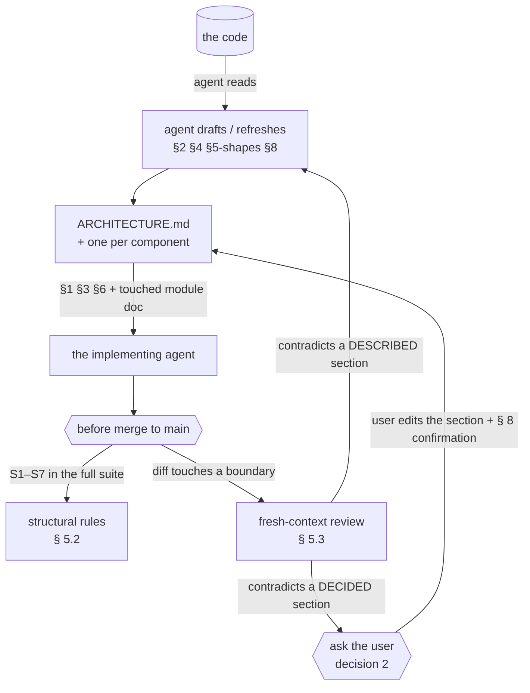

# DESIGN-017: The architecture document is written by the agent and decided by the user

> Status: locked
> Date: 2026-09-09 · Locked: 2026-09-15
> Amended: 2026-09-15 — decision 1 reversed by the user and decision 6 answered; § 1.4–1.5 and § 5.2–5.4 added; decisions 7–10 opened
> Author: PMO Agent   · Implementation owner: Coding Agent
> Linked OKR: —
> Supersedes: —   · Superseded by: —
> Revisits: `packs/software-ops/architecture.md`, `schema/state-schema.json § files[id=architecture]`, `work/state/ARCHITECTURE_TEMPLATE.md`, `work/SKILL.md § architecture`, `work/reference/dispatch.md § Architecture preamble`, `ARCHITECTURE.md § 3` and `§ 6`, `tests/test_router_budget.py`
> Sign-off: User Decisions 1–10 answered by Ran Jiao — 2–5 on 2026-09-09; 1 (reversed), 6 and 7–10 in session on 2026-09-15. Moved `draft` → `locked` without an `in_review` hold, as `DESIGN-013`, `DESIGN-014` and `DESIGN-020` did. The lock-time `reference/input-quality.md § 3` pass raised 3.4 (goal 3 had no measure) and an implementation plan with no verification on eleven of twelve rows; both were fixed before lock at the user's choice — goal 3, and § 6's Verification column.

## 1. Problem

Perry ships an architecture discipline and has never used it. Measured
2026-09-09 on this repository: `perry-state --section architecture` reported
`exists: false`, while `packs/software-ops/architecture.md` (292 lines), a
110-line template, a parser (`viewer/parsers.py § parse_arch_meta`), a schema
declaration, a dispatch compliance gate and an `architecture-audit` subcommand
had all been shipped for other projects to use.

### 1.1 The premise it was built on is no longer true

The shipped design is built on one sentence — **"The user writes it. Agents read
it. The PMO enforces it."** Everything follows from that: `owner: user` in the
schema, "Agents never write" in the pack, `Status: draft` until the user
finishes authoring, and a dispatch gate that only arms when they do.

The user's position, 2026-09-09: *nobody in the AI era wants to hand-write a
few hundred lines of documentation.* The document is written by the agent. It
serves two readers at once — the user, to understand a system that no longer
fits in one head, and the agent, as the overall design it implements against.

That is not a small edit to the pack. It removes the property the enforcement
loop rested on.

### 1.2 A document written and read by the same agent is a mirror

The user-authored version could say **"the code must not do X"**, and a change
contradicting it was refused. The refusal was credible because the document's
author and the code's author were different.

Agent writes, agent reads, and the default outcome is a mirror: the code is
whatever it is, the document is regenerated to match, and it never disagrees
with anything. It keeps its value for the user — a readable map — and loses all
of it for the agent, because `Touches architecture:` and the review gate then
compare a change against a description of that same change.

**This is the whole design problem.** Everything below is one answer to it:
separate what the document DESCRIBES from what it DECIDES, and let the agent do
all the typing in both.

### 1.3 The location was wrong, and the schema is why

`schema/state-schema.json` anchors `ARCHITECTURE.md` at the STATE root;
`packs/software-ops/architecture.md` says "at the project root". For Perry —
state root `perry/` — those are different files, and the first draft of this
work went to `perry/ARCHITECTURE.md` by following the schema.

`perry/` is runtime state: board, journal, evidence, seven stores. An
architecture document describes CODE and belongs where someone reading the code
finds it. The file now sits at the repository root, and the tooling cannot see
it: `--section architecture` reports `exists: false` on a project that has one.
`.perry/config.jsonl` already separates `pmo_repo_path` from `code_repo_path`,
so a resolver has somewhere to read from.

### 1.4 Six days later, the loop has never run

Measured 2026-09-15. Decision 1 as first answered accepted one cost in writing —
*between audits, nothing catches drift* — and made a periodic agent audit the
only guard. The audit has no cadence yet (B2 is unbuilt), so that cost has been
the whole cost:

- **The compliance loop is prose.** `work/reference/dispatch.md` injects the
  full document into every dispatch and asks for an `ARCHITECTURE COMPLIANCE`
  block in the result. Of the 97 result files in `perry/evidence/2026-09/`,
  **none** contains one (`grep -rliE 'ARCHITECTURE COMPLIANCE'`).
- **The tooling still cannot see the file.** `perry-state --section
  architecture` reports `exists: false`; A2 is unbuilt.
- **The document drifted exactly as predicted, and nothing noticed.**
  `ARCHITECTURE.md § 2` says `tests/` has 136 modules; there are 143. § 3's
  `Forbidden` list still says *"An agent writing `ARCHITECTURE.md`. This file is
  the user's."*, while § 6 NN-6 — user-confirmed twice since — says an agent
  writes the descriptive sections.
- **The executor is asked to certify its own compliance**, which is § 1.2's
  mirror moved one step later.

The user reversed decision 1 on 2026-09-15: **structural rules are checked
mechanically; meaning is reviewed by an agent.**

### 1.5 The skill prose has the same problem and no document at all

Measured 2026-09-15, by load tier (bytes ÷ 4 for tokens):

| Tier | Files | Bytes | ≈ tokens | Budgeted |
|---|---|---|---|---|
| L0 router `SKILL.md` | 1 | 20,457 | 5,114 | yes |
| L1 lane `SKILL.md` | 3 | 82,542 | 20,635 | yes |
| L2 `*/reference/`, `reference/` | 39 | 524,976 | 131,243 | no |
| L3 `modes/`, `packs/`, templates, `state/` scaffolds | 48 | 164,135 | 41,033 | no |

`tests/test_router_budget.py` holds a byte budget for the four L0 and L1 files.
The largest L2 page, `work/reference/subcommands.md`, is 81,996 bytes. Since
2026-09-01, 37 commit subjects describe correcting prose that had become false
(a subject-line heuristic: `false|stale|docs?:|prose|no longer|still (says|tells)`).
OKR v3 Objective 3 says the prose is the product; it is the one component with
no architecture.

## 2. Goals

1. An agent can write and keep the whole document current without asking, for
   everything that is a DESCRIPTION of the system.
2. An agent cannot change what the document DECIDES without the user seeing the
   question first.
3. **The injection is bounded and measured.** What a dispatch receives — § 1,
   § 3 and § 6 of the root document, plus the module document of each touched
   component — is counted in bytes by § 5.4's context bill and held under a
   declared budget; and each § 6 rule is specific enough that a review can
   answer *holds · contradicts · not touched* with a cited line.
4. **Structure is checked; meaning is reviewed.** A rule that comes from a
   DECIDED section and can be stated over paths, imports, sizes or bytes is a
   test that runs before every merge to `main`. Whether a change honours a
   rule's meaning is an agent's review, triggered by the paths the change
   touches — never a test (`ARCHITECTURE.md § 6` NN-4).
5. One component, one document. The root document's §2 is the component list
   and therefore the index of module documents.
6. A document that exists is in force. There is no draft state.
7. The resolver finds the document where the code is.
8. **A decided section cannot change silently.** A change to § 1, a `Forbidden`
   line in § 3 or a confirmed § 6 rule, with no matching user confirmation in
   § 8, turns a test red.
9. **The skill prose is a component with the same discipline**: a load tier per
   file, a byte budget per tier, and a context bill per command.

## 3. Non-Goals

- **No semantic check in code.** No test reads a section's prose to decide
  whether the code honours it. No test checks a DESCRIBED section — § 2's prose,
  § 4 — against the code. That half of decision 1's first answer stands: a check
  that must be edited with every refactor is a tax on the refactor. Only rules
  derived from DECIDED sections become tests.
- **No behavioural evaluation of the skill prose** — scenario runs graded by an
  agent. User decision 6, 2026-09-15: deferred to phase 005.
- **No mermaid checking.** § 8's question stays open.
- **Not a second design document.** `perry/design/DESIGN-*.md` argue a change;
  this describes the system as it stands. A design that lands changes the
  architecture document; it does not become one.
- **Not per-file documentation.** One document per COMPONENT, and components
  are named in §2 by the user's confirmation.
- **Not a replacement for `bin/README.md`.** That is usage. This is structure.

## 4. User Decisions

| # | Decision | Options | Chosen | Date |
|---|---|---|---|---|
| 1 | How much mechanical checking | A lint mode + tests per rule / cheap existing signals only / none / structural rules checked + meaning reviewed | **Structural rules checked mechanically; meaning reviewed by an agent** — reverses the 2026-09-09 answer *cheap existing signals only* | 2026-09-15 |
| 2 | What a change touching a hard `§6` rule does | Refuse the dispatch / ask the user / warn and proceed | **Ask the user** | 2026-09-09 |
| 3 | Module document granularity | Per directory / per component, user-confirmed / per file | **One component, one document; §2's list is user-confirmed** | 2026-09-09 |
| 4 | The `Status: draft \| active` field | Keep, gate on `active` / drop it: existing means in force | **Drop it** | 2026-09-09 |
| 5 | The module document's line cap | 300 / 600 / the root's 500 covers the set | **600** | 2026-09-09 |
| 6 | How the skill prose is checked | Structural budgets + context bill / plus scenario evaluations / none | **Structural budgets + context bill only** — scenario evaluations deferred to phase 005 | 2026-09-15 |
| 7 | Where a decided section's confirmation is recorded | Content hash in the § 8 entry (Recommended) / USER- row id only / both | **Content hash in the § 8 entry** | 2026-09-15 |
| 8 | When the meaning review runs | At merge, by touched paths (Recommended) / every dispatch / phase close | **At merge, by touched paths** | 2026-09-15 |
| 9 | How a command's load set is declared | The lane index reference column (Recommended) / a new data file / a schema entry | **The lane index reference column** | 2026-09-15 |
| 10 | Measured numbers in shipped prose | Dated or generated only (Recommended) / allowed / warn only | **Dated or generated only** | 2026-09-15 |

**Decision 1, as first answered and as reversed.** Answered 2026-09-09: the four
checks on the table — every §2 component resolves to a path, every §6 rule
carries a runnable `Check:`, every mermaid node names something real, a module
document older than its directory's last commit is stale — were all cheap to
write and none free to keep, and the user chose flexibility; a stale document
would be discovered by an agent reading it, not by a red suite. Reversed
2026-09-15 on § 1.4's evidence: the audit that answer relied on never ran, and
the drift it accepted is already in the file. What survives from the first
answer is the line between the two kinds of section: DESCRIBED sections are
still never checked, so a refactor still never needs a test edit to rename a
component in § 2's prose.

**On 7.** A hash of the decided sections' bytes is a filesystem fact a test can
compare. A `USER-` row id alone says a question was answered, not which bytes it
approved — and the § 3 `Forbidden` line in § 1.4 is a change nobody can date.

**On 8.** At merge, the reviewer is not the author, which is what § 1.2 needs.
Every dispatch pays for a review on changes that touch no boundary, against
`ADR-018`'s calibration. Phase close is too late to stop a change landing.

**On 9.** The lane subcommand indexes already carry a column naming the
reference page(s) each subcommand reads, and `tests/test_router_budget.py` and
`tests/test_pointers_resolve.py` already extract citations lexically. A new data
file is a second copy of that column (`ADR-019`). A schema entry is a
project-wide edit that needs the user's consent every time it changes.

**On 10.** § 2's "136 modules" is the instance, and "Twenty executables" in
`bin/ARCHITECTURE.md` is the next one.

**Decision 4 has a consequence in code.** `perry-state` warns
`ARCHITECTURE.md is still Status: draft` and the pack arms the dispatch gate on
`Status: active`. Both go: the file existing is the arming condition.
`parse_arch_meta` keeps reading `Status:` for a release, so an old document does
not become unreadable, and reports it as `""`.

## 5. Architecture

### 5.1 Authority is per section; the typing is all the agent's

| Section | Kind | Agent may | User confirms |
|---|---|---|---|
| §1 Mission & scope | decided | draft, propose a change | yes |
| §2 Components | described | rewrite freely | the LIST (it is the module index) |
| §3 Boundaries | both | rewrite what IS | the `Forbidden` lines |
| §4 Data flow | described | rewrite freely | — |
| §5 Contracts | both | rewrite shapes | a version bump |
| §6 Non-negotiables | decided | ADD marked `proposed`; never delete | every rule |
| §7 Open questions | decided | ADD; never delete | closing one |
| §8 Change log | described | append | — |

"Confirms" means the question reaches the user before the change lands. Perry
has the mechanism: a `USER-` row in the input queue, which the standup surfaces
and ages.

**The documents an implementing agent is given** are § 1, § 3 and § 6 of the
root document and the module document of each component it is touching. § 2,
§ 4, § 5 and § 8 are read on demand. That is what keeps the injection affordable
as components multiply, and it is why §2 is the index rather than a directory
scan.

**Where they live.** The root document is at the code repository root. A module
document is `<component>/ARCHITECTURE.md`, beside the code. Perry's own state
root holds none. The resolver reads `code_repo_path` from `.perry/config.jsonl`
when it is set, and the project root otherwise.

### 5.2 Structural rules, checked before every merge

Every rule comes from a DECIDED section and names it. A check reads typed facts
— paths, Python import statements, byte and line counts, hashes — and never
prose. The rules live in one module, `tests/test_architecture_rules.py`, which
runs in the full suite before every merge to `main` (`DESIGN-021` decision 1)
and declares that it covers every path. Each rule has a named mutation that
turns it red.

| Rule | From | Check |
|---|---|---|
| S1 `viewer/parsers.py` imports nothing from `bin/` | § 3, allowed directions | the file's import statements, read with `ast`, name no `bin/` module |
| S2 one reader per state file | § 6 NN-1 | NN-1's own `Check:` — no `def parse_` in `bin/` outside the two store modules — run as a test |
| S3 standard library only | OKR anti-goal; the phase cost ceiling | every import in `bin/`, `viewer/` and `tests/` is in `sys.stdlib_module_names` or resolves inside the repository |
| S4 the suite never writes its own tree | § 6 NN-5 | `tests/tree_guard.py`, already on every exit path, declared as NN-5's `Check:` |
| S5 every component is named | § 2's list, user-confirmed (decision 3) | each top-level directory, and each `bin/` executable, appears in a § 2 heading or in `bin/perry list`, or on a declared exempt list |
| S6 size caps | the header caps; decision 5; § 5.4's tier budgets | the root document ≤ 500 lines, a module document ≤ 600, every shipped page within its tier's budget |
| S7 decided sections change only with a confirmation | § 6 NN-6 | the hash of § 1, § 3's `Forbidden` lines and § 6 equals the hash recorded in the newest `User-confirmed` § 8 entry (decision 7) |

Every § 6 rule then carries either `Check:` naming its test, or `Check: review —
<trigger>` when the rule is about meaning (NN-2's "every reading derives from the
record", NN-4). S5 reads headings lexically, the way `test_pointers_resolve.py`
reads `§` citations; it judges no prose.

A red S7 says what to do next: *a decided section changed without a
confirmation — ask the user, then record the confirmation in § 8.* That is the
only path by which one session's agent can change what the architecture
decides.

### 5.3 Meaning, reviewed by an agent at merge

The executor no longer certifies its own compliance. Before the primary checkout
merges a branch, typed facts of the diff decide whether a review runs
(decision 8):

- a changed path under a § 3 boundary: `viewer/parsers.py`, `bin/lib/`,
  `schema/`, a lane `SKILL.md`, a `schema/*-contract.md` page;
- a new top-level directory or `bin/` executable;
- a changed contract version;
- a change to `ARCHITECTURE.md` or to a module document.

None of these → no review; the structural rules have already run in the full
suite. Any of them → a fresh-context agent receives § 1, § 3, § 6, the module
document of each touched component, and the diff, and answers per rule:
*holds · contradicts · not touched*, citing the line each answer rests on. A
contradiction of a DECIDED section is decision 2's ask. The answer is written to
the merge's evidence as the `ARCHITECTURE COMPLIANCE` block `dispatch.md`
already names — now produced by a reader other than the author.

### 5.4 The skill prose as a component

The tier is the file's location; no new metadata.

| Tier | Files | Loaded when | Budget |
|---|---|---|---|
| L0 | `SKILL.md` | every invocation | 20,480 bytes (existing) |
| L1 | `goals/`, `work/`, `decide/` `SKILL.md` | the lane is entered | the existing per-file budgets |
| L2 | `*/reference/*.md`, `reference/*.md` | a subcommand names the page | proposed 32,768 bytes per page; three pages exceed it today: `work/reference/subcommands.md` 81,996, `work/reference/dispatch.md` 43,742, `reference/diagnose.md` 34,926 |
| L3 | `modes/`, `packs/`, templates, `*/state/` scaffolds | on condition, or copied into a project | set at implementation from the measured distribution |

- **P1 · Direction.** L0 points; it restates no L1 or L2 procedure. A procedure
  lives on one page; every other page cites it by `§`, and resolution is already
  tested.
- **P2 · Budget per tier** (S6). Over budget → the page is split along its own
  `##` sections. The test states the overflow; the agent chooses the cut.
- **P3 · Context bill.** For a subcommand: L0, plus its lane file, plus the L2
  pages its index row names (decision 9). A read-only command prints it; five
  chosen subcommands — the snapshot, `add-task`, `close-task`, `dispatch` and
  `plan-phase` — each get a budget.
- **P4 · Measured numbers** (decision 10). A count in shipped prose is produced
  by a command or carries its measurement date; an undated one is reported by
  lint, never corrected automatically.
- **P5 · Duplication, advisory.** Paragraphs repeated across shipped pages,
  found lexically, are listed for an agent to decide which copy stays (NN-4).

## 6. Implementation plan

| Phase | Scope | Verification | Owner |
|---|---|---|---|
| A1 | `schema/state-schema.json`: `files[id=architecture]` loses `owner: user`, gains per-section authority as a note; `anchor` becomes the code root; module documents declared as a kind. **A schema edit: needs the user's consent at dispatch** (`.perry/hook.md` high-stakes operations) | the schema file declares the code-root anchor and no `owner: user`; `perry-lint --templates` and the schema tests pass | Coding Agent |
| A2 | `perry-state`: resolve the document at the code root; drop the `Status: draft` warning; keep `last_reviewed` ageing | on this repository `--section architecture` reports `exists: true`, and `false` on a copy with the root file removed; no draft warning is emitted | Coding Agent |
| A3 | `work/state/ARCHITECTURE_TEMPLATE.md`: header rewritten (written-by / confirmed-by, no `Status`), §6 gains `proposed` as a state, `Check:` names a test or a review trigger | a scaffold from the template has no `Status:` line and a § 6 rule stub with `Check:`; the template lint passes | Coding Agent |
| B1 | `packs/software-ops/architecture.md`: the contract table, `init` becomes "the agent drafts from the code", the gate arms on existence, decision 2's ask replaces the refuse | the pack's table matches § 5.1 row for row; on a fixture the gate arms with the file present and not without it | Coding Agent |
| B2 | `architecture-audit` gets a cadence and a `Last reviewed` write-back, scoped to DESCRIBED sections — the decided ones are § 5.2's | on a fixture the audit writes `Last reviewed` and the standup ages it; the audit brief names only DESCRIBED sections | Coding Agent |
| C1 | `work/SKILL.md` and `reference/` pointers; `/perry work architecture init` scaffolds module documents from §2 | on a fixture with a § 2 list, `init` creates one module document per listed component and none for an unlisted directory | Coding Agent |
| D1 | `tests/test_architecture_rules.py`: S1–S7, each with a named mutation; every § 6 rule gains its `Check:` | each of S1–S7 is red under its named mutation and green on the unmodified tree | Coding Agent |
| D2 | § 8 confirmation format carrying the decided-section hash (decision 7); § 3's `Forbidden` line about agents writing the file, proposed to the user for NN-6 | an edit to a § 6 rule with no new § 8 hash turns S7 red; the same edit with a recorded confirmation is green | Coding Agent + User |
| D3 | The merge-time review: trigger paths, a reviewer brief in `work/reference/review.md`, the compliance block written at merge; dispatch injection narrowed to § 1, § 3, § 6 and the touched module document; the executor-side block removed from `dispatch.md` | a diff touching `viewer/parsers.py` yields a review block at merge citing a rule line; a diff touching only `perry/` yields none; `dispatch.md` no longer asks the executor for the block | Coding Agent |
| E1 | L2 and L3 budgets in the budget test; the three over-budget L2 pages split | the budget test fails on a page one byte over its tier budget; the three named pages are under budget after the split; `test_pointers_resolve` stays green | Coding Agent |
| E2 | The context bill: a read-only command, and budgets for the five subcommands | the command prints bytes for each of the five subcommands; a budget exceeded by one byte is reported | Coding Agent |
| E3 | P4's undated-number report and P5's duplication advisory; `ARCHITECTURE.md § 2–3` counts swept | an undated count added to a shipped page is reported by lint; `ARCHITECTURE.md § 2–3` carries no undated count | Coding Agent |

## 7. Risks & mitigations

| Risk | Detection | Mitigation |
|---|---|---|
| Structural rules turn every refactor into a test edit — the cost decision 1 was first chosen to avoid | commits editing `tests/test_architecture_rules.py` in the same change as a refactor | seven rules, each from a DECIDED section; no rule checks a DESCRIBED one; a rule is deleted with its section |
| The mirror moves to the reviewer: an agent reading only the diff substitutes its own idea of a rule | a compliance block whose answers cite no rule line | the brief carries § 3 and § 6 verbatim, and each answer must cite the line it rests on |
| S7 blocks legitimate descriptive edits | S7 red on a change touching only § 2, § 4 or § 8 | the hash covers § 1, § 3's `Forbidden` lines and § 6 only |
| Splitting L2 pages adds hops, and an agent reads more in total | the context bill rises after a split | the bill counts bytes loaded per command, not per page |
| Module documents multiply and the injection stops being affordable | `perry-state-cost`; the 500/600-line caps | only the touched component's document is injected |
| `proposed` rules pile up unread | the standup surfaces `USER-` rows and ages them | the existing input-queue mechanism, not a new one |

## 8. Open questions

- ~~Does a module document need its own cap?~~ **Answered 2026-09-09: 600
  lines** (decision 5). The root's is 500 and a module's is larger: the root is
  read by every dispatch, a module document only by the agent touching that
  component, so the budgets are paid by different readers.
- What does the audit do when it finds drift in a DESCRIBED section — open a
  `USER-` row, write a finding under `architecture/audit-history/`, or edit and
  report?
- ~~Do the three lane directories count as components?~~ **Answered by § 5.4**:
  the skill prose is one component with four tiers; until it outgrows it, § 5.4
  is its module document.
- On a host Python older than 3.10, `sys.stdlib_module_names` does not exist.
  Does S3 fall back to a checked-in list, or abstain loudly?
- Should `perry-lint` check mermaid? `perry-state` counts fenced blocks and
  nothing consumes the number.

## 9. Changes (append-only after lock)

- 2026-09-09 — created. Driver: the user's request for an architecture channel
  the agent maintains, and the discovery that Perry ships the opposite premise.

## 10. References

- `ARCHITECTURE.md`, `bin/ARCHITECTURE.md` — the two documents this design
  generalises from; both written 2026-09-09.
- `packs/software-ops/architecture.md` — the shipped discipline, user-authored
- `schema/state-schema.json § files[id=architecture]` — `owner: user`, `anchor: state`
- `viewer/parsers.py § parse_arch_meta` — what the tools already read, including `mermaid_count`
- `perry/design/DESIGN-014-how-much-python.md` — why meaning is an agent's and not a linter's
- `perry/design/DESIGN-021-test-tiers.md` — where the full suite runs, and so where § 5.2 runs
- `perry/decisions/ADR-018-verification-is-calibrated-to-blast-radius.md` — why the review is triggered, not universal
- `tests/test_router_budget.py`, `tests/test_pointers_resolve.py` — the budget and citation checks § 5.4 extends
- `work/reference/dispatch.md § Architecture preamble` — the injection and compliance block § 5.3 moves to merge
